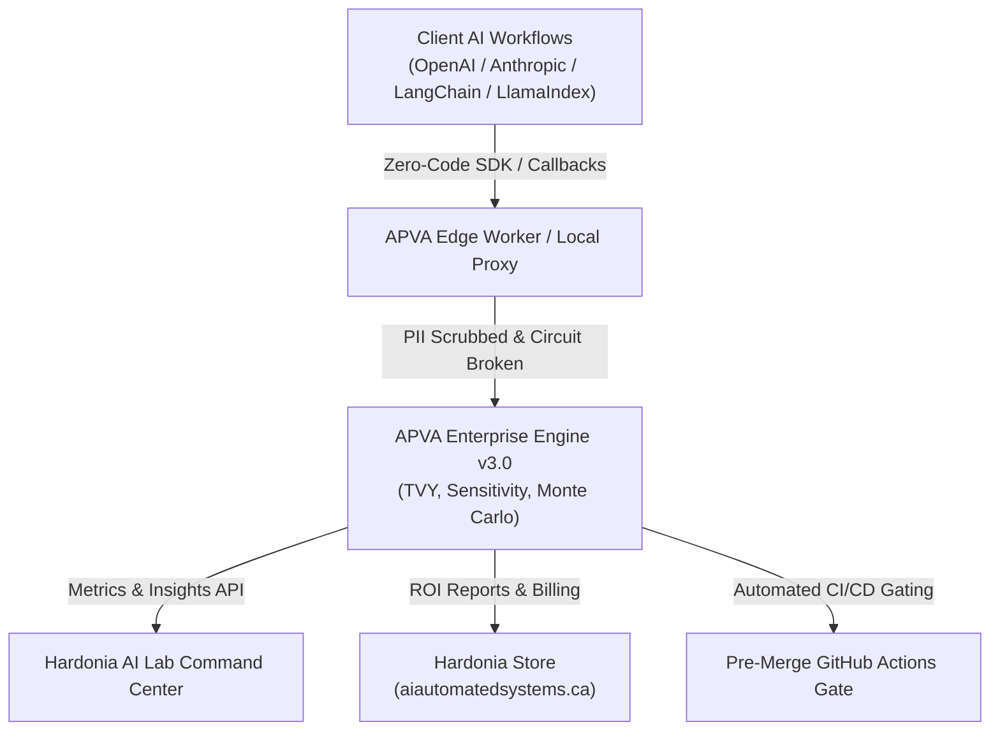

# APVA — AI Productivity & Value Architecture

<!-- BEGIN: REPO HERO -->

<!-- END: REPO HERO -->

> Measure the **true enterprise ROI of Generative AI** as a single time-denominated metric: **True Value Yield (TVY)**.

[](CHANGELOG.md)
[](https://www.python.org/)
[](LICENSE)
[](https://github.com/Hardonian/apva-framework)
[](https://aiautomatedsystems.ca)

---



---

## The Problem

Traditional AI observability answers *"how many tokens were consumed and what was the API latency?"* — ignoring the fundamental metric executive leadership demands: **net engineering hours saved**.

APVA answers: *"How much reliability-discounted, friction-adjusted human time did this AI workflow actually save — and what is it worth in USD?"*

$$\text{TVY} = (\text{Gross Time Saved} \times \text{RAG Reliability}) - \text{Guardrail Friction Tax}$$

$$\text{TVY}_{\text{USD}} = \frac{\text{TVY}_{\text{min}}}{60} \times \text{Wage}_{\text{hourly}}$$

---

## The Three Pillars

| Pillar | Captures | Mathematical Formulation |
| :--- | :--- | :--- |
| **Productivity** | Skill-stratified human baselines + epistemic verification load | $\text{GTS} = (T_{\text{baseline}} \times M_{\text{skill}}) - (T_{\text{AI}} + T_{\text{verify}})$ |
| **RAG Reliability** | Deterministic exact-span recall + SLM judge faithfulness | $\rho_{\text{RAG}} = (0.60 \times \text{Recall}) + (0.40 \times \text{Faithfulness})$ |
| **Value / Friction** | Guardrail latency overhead, false-positive appeals, and session drops | $\tau = T_{\text{latency}} + (\text{FPR} \times T_{\text{penalty}}) + T_{\text{CRA}}$ |

---

## From AI telemetry to an approved investment

APVA now carries the measurement all the way into an enterprise decision. The
multivariate value engine combines observed workflow performance with workforce
scale, adoption, realization, implementation cost, platform cost, variable AI
cost, risk avoidance, growth, and discount rate.

Every business case includes:

- Annual task volume, per-task value, first-year net value, recurring value, ROI, payback, break-even volume, and discounted NPV.
- Deterministic Monte Carlo downside/upside bounds and a bounded adoption × reliability × cost × volume stress matrix.
- Transparent policy-as-code gates for value, quality, downside, evidence confidence, payback, ROI, and guardrail friction.
- Ranked optimization levers, a rollout posture (`scale`, `controlled_pilot`, `optimize`, or `do_not_scale`), and a reproducible SHA-256 audit trail.
- Portfolio ranking and budget allocation across as many as 50 competing AI use cases.

### The X-factor: value integrity, not activity

Most productivity scorecards stop at adoption, output volume, latency, tokens,
or self-reported time saved. APVA can carry the harder signals that determine
whether the value is real, durable, and safe:

| Signal | What APVA measures | Why it changes the decision |
|---|---|---|
| Causal Value Yield | TVY × realized-value rate × causal attribution confidence | Discounts savings that would have happened without the AI workflow |
| Enterprise Value Capture | adoption × realization × causal confidence | Exposes the gap between theoretical and actually captured value |
| Coordination Dividend | handoff, search, meeting, and queue time removed per task | Captures system-level value outside the individual prompt session |
| Knowledge Compounding Dividend | reusable-output rate × expected reuses × time saved per reuse | Values durable artifacts instead of treating every output as disposable |
| Downstream Expected Loss | escaped-error probability × loss severity × blast radius | Prevents a fast but high-consequence workflow from appearing productive |
| Trust-Adjusted Autonomy | autonomous completion × reliability × (1 − human override) | Measures safe delegation, not raw automation |
| Tail-Value Risk | P(TVY < 0), 5% VaR, and worst-5% conditional VaR | Shows how bad weak outcomes get instead of hiding them inside an average |
| Carbon-Adjusted Cost | task CO2e × internal carbon price | Makes enterprise externalities explicit in unit economics |

Together these produce a causal, compounding, risk-adjusted value envelope per
task. Each component remains visible to avoid a persuasive composite score
hiding weak evidence or double counting.

Run the complete reference case:

```bash
apva business-case examples/enterprise-business-case.json \
  --format table \
  --require-decision scale controlled_pilot
```

The included reference data produces a `SCALE` decision and an auditable
three-year business case. The GitHub workflow in
`.github/workflows/apva-value-gate.yml` publishes that decision as a build
artifact and fails when the rollout posture falls outside policy.

For live systems, the dashboard’s **Value Studio** converts observed tenant
telemetry into the same business case without re-keying measurements. The API
surfaces are:

```text
POST /api/v1/analysis/business-case
POST /api/v1/analysis/observed-business-case
POST /api/v1/analysis/portfolio
GET  /api/v1/analysis/policy-template
```

See the [enterprise adoption playbook](docs/enterprise-adoption.md) for the
measurement contract, rollout sequence, governance model, and workflow patterns.

---

## 5-Minute Quickstart

### 1. Installation

```bash
pip install apva-framework
# or with uv:
uv add apva-framework
```

### 2. Built-in Simulation & Scorecard

```bash
# Run representative enterprise demo with sensitivity & Monte Carlo CI
apva demo --format table

# Generate executive audit scorecard
apva audit --golden-set data/golden_dataset.json --hourly-rate 85.0
```

Output:

```text
# APVA Enterprise AI ROI Audit Scorecard
> Status: [NET-POSITIVE ROI] | Audit Standard: APVA Framework v3.0.0

| Metric | Measured Value | Unit |
|---|---|---|
| True Value Yield (TVY) | +20.91 | Minutes / Task |
| Financial Value Yield | $+29.62 | USD / Task |
| Projected Annual Impact (100 Engineers) | $+5,924,199.67 | USD / Year |
| Golden Set Recall | 98.7% | Exact Span Recall |
| RAG Reliability Coefficient | 98.7% | Blended Reliability |
| Guardrail Latency Tax | 0.80 | Minutes Friction |
```

### 3. Pre-Merge CI/CD Gate in GitHub Actions

Fail pull requests if retrieval faithfulness degrades below 85%:

```yaml
# .github/workflows/aias-eval.yml
name: APVA Quality Gate
on: [pull_request]

jobs:
  tvy-gate:
    runs-on: ubuntu-latest
    steps:
      - uses: actions/checkout@v4
      - uses: actions/setup-python@v5
        with:
          python-version: '3.12'
      - run: pip install apva-framework
      - run: apva run-eval --golden-set data/golden_dataset.json --threshold 0.85
```

### 4. Zero-Code Client Instrumentation

#### Native OpenAI Client Wrapper

```python
from openai import OpenAI
from apva_sdk.integrations import APVAOpenAI

client = APVAOpenAI(
    client=OpenAI(),
    app_name="support-copilot",
    human_baseline_time=25.0,  # 25 min unaided
    hourly_rate_usd=85.0,
)

# Automatically streams TVY telemetry upon completion
response = client.chat.completions.create(
    model="gpt-4o",
    messages=[{"role": "user", "content": "Diagnose customer issue #402."}],
)
```

#### Native Anthropic Client Wrapper

```python
import anthropic
from apva_sdk.integrations import APVAAnthropic

client = APVAAnthropic(
    client=anthropic.Anthropic(),
    app_name="legal-analyzer",
    human_baseline_time=45.0,
    hourly_rate_usd=150.0,
)

response = client.messages.create(
    model="claude-3-5-sonnet",
    messages=[{"role": "user", "content": "Review the liability clause."}],
)
```

### 5. Production observability and tuning

The authenticated `GET /api/v1/metrics/prometheus` endpoint exposes both business
outcomes and bounded-cardinality runtime signals:

- HTTP request counts, in-flight requests, cumulative latency, and maximum latency by route.
- TVY, financial value, reliability, guardrail friction, shadow-event rate, and financial-data coverage.
- Aggregate-cache hits, misses, and invalidations for cost and freshness monitoring.

Tenant aggregates use a write-invalidated 15-second cache by default, and daily
timeseries are computed with one grouped query. Configure the tradeoffs with
`APVA_METRICS_CACHE_TTL_SECONDS`, `APVA_DB_POOL_SIZE`, and
`APVA_DB_MAX_OVERFLOW`. Always set a unique `APVA_JWT_SECRET` in production.

Apply database performance indexes during deployment:

```bash
cd apps/backend
uv run alembic upgrade head
```

---

## Competitive Advantage

| Architectural Feature | APVA Framework | LangSmith | Datadog LLM | Arize Phoenix |
| :--- | :---: | :---: | :---: | :---: |
| **Primary Metric** | **True Value Yield (TVY)** | Latency / Tokens | Latency (ms) | Drift Score |
| **Financial Translation** | ✅ **Direct USD / Task** | ❌ Cost only | ❌ None | ❌ None |
| **Skill Stratification** | ✅ **5 Tiers (Intern to Expert)** | ❌ None | ❌ None | ❌ None |
| **Epistemic Burden Accounting** | ✅ **Verification Penalized** | ❌ None | ❌ None | ❌ None |
| **Guardrail Tax Modeling** | ✅ **Latency + FPR + CRA** | ❌ None | ⚠️ Partial | ❌ None |
| **Sensitivity & Monte Carlo** | ✅ **Standard Feature** | ❌ None | ❌ None | ❌ None |
| **Local-First & Air-Gapped** | ✅ **SQLite / Postgres / ClickHouse** | ❌ Cloud-First | ❌ Cloud Only | ⚠️ Partial |
| **Multi-Tenant Metered Billing** | ✅ **Stripe Native** | ❌ Tiered Seats | ❌ Custom | ❌ None |
| **Investment Decision Engine** | ✅ **ROI, Payback, NPV, Downside, Policy Gates** | ❌ None | ❌ None | ❌ None |
| **Portfolio Capital Allocation** | ✅ **Up to 50 AI Use Cases** | ❌ None | ❌ None | ❌ None |

---

## CLI Reference

| Command | Description |
| :--- | :--- |
| `apva demo [--format table/markdown/csv/json]` | Run built-in demo simulation with sensitivity & Monte Carlo |
| `apva audit --golden-set <file> [--hourly-rate <usd>]` | Generate turnkey Markdown audit scorecard |
| `apva run-eval --golden-set <file> [--threshold <0.85>]` | Execute CI/CD exact-span recall evaluation gate |
| `apva sensitivity <file> [--delta <0.05>]` | Run parameter sensitivity analysis on a benchmark |
| `apva compare <file1> <file2> ...` | Rank and compare multiple benchmark configurations |
| `apva validate --golden-set <file>` | Validate golden dataset structure and integrity |
| `apva version` | Display APVA version and runtime environment info |
| `apva proxy --port <port> --target <url>` | Run universal transparent local AI proxy |

---

## Architecture & Layout

```text
apva/                  # Core TVY calculation engine, scoring, datasets, formatters
apps/
  backend/             # Enterprise FastAPI service (telemetry, batch, eval, billing)
  dashboard/           # React + Vite analytics UI
  edge-worker/         # Cloudflare Worker global edge ingest
packages/
  sdk/                 # Python SDK (client, decorators, OpenAI/Anthropic proxies)
  apva-langchain/      # Native zero-code LangChain callback handler
  apva-llamaindex/     # Native zero-code LlamaIndex callback handler
  cli/                 # CLI package
  sdk-ts/              # TypeScript SDK with native fetch
deploy/                # Cloudflare Workers, D1 schema, and Storefront widget
tests/                 # Test suite (unit, integration, backend, CLI)
examples/              # Quickstart runnable scripts
data/                  # Production golden evaluation datasets
```

---

## License

Apache 2.0 — see [LICENSE](LICENSE).

---

**Part of the [Hardonia](https://aiautomatedsystems.ca) AI Engineering Ecosystem.**
