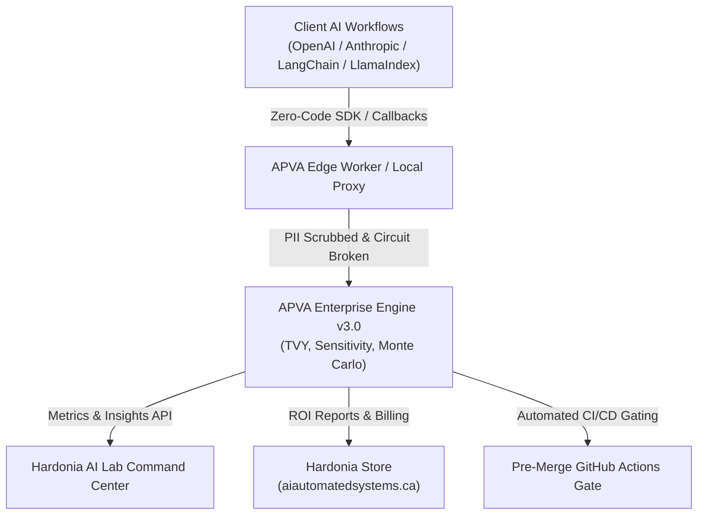

# APVA — AI Productivity & Value Architecture

> Measure the **true enterprise ROI of Generative AI** as a single time-denominated metric: **True Value Yield (TVY)**.

[](CHANGELOG.md)
[](https://www.python.org/)
[](LICENSE)
[](https://github.com/Hardonian/apva-framework)
[](https://aiautomatedsystems.ca)

---



---

## The Problem

Traditional AI observability answers *"how many tokens were consumed and what was the API latency?"* — ignoring the fundamental metric executive leadership demands: **net engineering hours saved**.

APVA answers: *"How much reliability-discounted, friction-adjusted human time did this AI workflow actually save — and what is it worth in USD?"*

$$\text{TVY} = (\text{Gross Time Saved} \times \text{RAG Reliability}) - \text{Guardrail Friction Tax}$$

$$\text{TVY}_{\text{USD}} = \frac{\text{TVY}_{\text{min}}}{60} \times \text{Wage}_{\text{hourly}}$$

---

## The Three Pillars

| Pillar | Captures | Mathematical Formulation |
| :--- | :--- | :--- |
| **Productivity** | Skill-stratified human baselines + epistemic verification load | $\text{GTS} = (T_{\text{baseline}} \times M_{\text{skill}}) - (T_{\text{AI}} + T_{\text{verify}})$ |
| **RAG Reliability** | Deterministic exact-span recall + SLM judge faithfulness | $\rho_{\text{RAG}} = (0.60 \times \text{Recall}) + (0.40 \times \text{Faithfulness})$ |
| **Value / Friction** | Guardrail latency overhead, false-positive appeals, and session drops | $\tau = T_{\text{latency}} + (\text{FPR} \times T_{\text{penalty}}) + T_{\text{CRA}}$ |

---

## 5-Minute Quickstart

### 1. Installation

```bash
pip install apva-framework
# or with uv:
uv add apva-framework
```

### 2. Built-in Simulation & Scorecard

```bash
# Run representative enterprise demo with sensitivity & Monte Carlo CI
apva demo --format table

# Generate executive audit scorecard
apva audit --golden-set data/golden_dataset.json --hourly-rate 85.0
```

Output:
```text
# APVA Enterprise AI ROI Audit Scorecard
> Status: [NET-POSITIVE ROI] | Audit Standard: APVA Framework v3.0.0

| Metric | Measured Value | Unit |
|---|---|---|
| True Value Yield (TVY) | +20.91 | Minutes / Task |
| Financial Value Yield | $+29.62 | USD / Task |
| Projected Annual Impact (100 Engineers) | $+5,924,199.67 | USD / Year |
| Golden Set Recall | 98.7% | Exact Span Recall |
| RAG Reliability Coefficient | 98.7% | Blended Reliability |
| Guardrail Latency Tax | 0.80 | Minutes Friction |
```

### 3. Pre-Merge CI/CD Gate in GitHub Actions

Fail pull requests if retrieval faithfulness degrades below 85%:

```yaml
# .github/workflows/aias-eval.yml
name: APVA Quality Gate
on: [pull_request]

jobs:
  tvy-gate:
    runs-on: ubuntu-latest
    steps:
      - uses: actions/checkout@v4
      - uses: actions/setup-python@v5
        with:
          python-version: '3.12'
      - run: pip install apva-framework
      - run: apva run-eval --golden-set data/golden_dataset.json --threshold 0.85
```

### 4. Zero-Code Client Instrumentation

#### Native OpenAI Client Wrapper
```python
from openai import OpenAI
from apva_sdk.integrations import APVAOpenAI

client = APVAOpenAI(
    client=OpenAI(),
    app_name="support-copilot",
    human_baseline_time=25.0,  # 25 min unaided
    hourly_rate_usd=85.0,
)

# Automatically streams TVY telemetry upon completion
response = client.chat.completions.create(
    model="gpt-4o",
    messages=[{"role": "user", "content": "Diagnose customer issue #402."}],
)
```

#### Native Anthropic Client Wrapper
```python
import anthropic
from apva_sdk.integrations import APVAAnthropic

client = APVAAnthropic(
    client=anthropic.Anthropic(),
    app_name="legal-analyzer",
    human_baseline_time=45.0,
    hourly_rate_usd=150.0,
)

response = client.messages.create(
    model="claude-3-5-sonnet",
    messages=[{"role": "user", "content": "Review the liability clause."}],
)
```

---

## Competitive Advantage

| Architectural Feature | APVA Framework | LangSmith | Datadog LLM | Arize Phoenix |
|:---|:---:|:---:|:---:|:---:|
| **Primary Metric** | **True Value Yield (TVY)** | Latency / Tokens | Latency (ms) | Drift Score |
| **Financial Translation** | ✅ **Direct USD / Task** | ❌ Cost only | ❌ None | ❌ None |
| **Skill Stratification** | ✅ **5 Tiers (Intern to Expert)** | ❌ None | ❌ None | ❌ None |
| **Epistemic Burden Accounting** | ✅ **Verification Penalized** | ❌ None | ❌ None | ❌ None |
| **Guardrail Tax Modeling** | ✅ **Latency + FPR + CRA** | ❌ None | ⚠️ Partial | ❌ None |
| **Sensitivity & Monte Carlo** | ✅ **Standard Feature** | ❌ None | ❌ None | ❌ None |
| **Local-First & Air-Gapped** | ✅ **SQLite / Postgres / ClickHouse** | ❌ Cloud-First | ❌ Cloud Only | ⚠️ Partial |
| **Multi-Tenant Metered Billing** | ✅ **Stripe Native** | ❌ Tiered Seats | ❌ Custom | ❌ None |

---

## CLI Reference

| Command | Description |
|:---|:---|
| `apva demo [--format table/markdown/csv/json]` | Run built-in demo simulation with sensitivity & Monte Carlo |
| `apva audit --golden-set <file> [--hourly-rate <usd>]` | Generate turnkey Markdown audit scorecard |
| `apva run-eval --golden-set <file> [--threshold <0.85>]` | Execute CI/CD exact-span recall evaluation gate |
| `apva sensitivity <file> [--delta <0.05>]` | Run parameter sensitivity analysis on a benchmark |
| `apva compare <file1> <file2> ...` | Rank and compare multiple benchmark configurations |
| `apva validate --golden-set <file>` | Validate golden dataset structure and integrity |
| `apva version` | Display APVA version and runtime environment info |
| `apva proxy --port <port> --target <url>` | Run universal transparent local AI proxy |

---

## Architecture & Layout

```text
apva/                  # Core TVY calculation engine, scoring, datasets, formatters
apps/
  backend/             # Enterprise FastAPI service (telemetry, batch, eval, billing)
  dashboard/           # React + Vite analytics UI
  edge-worker/         # Cloudflare Worker global edge ingest
packages/
  sdk/                 # Python SDK (client, decorators, OpenAI/Anthropic proxies)
  apva-langchain/      # Native zero-code LangChain callback handler
  apva-llamaindex/     # Native zero-code LlamaIndex callback handler
  cli/                 # CLI package
  sdk-ts/              # TypeScript SDK with native fetch
deploy/                # Cloudflare Workers, D1 schema, and Storefront widget
tests/                 # Test suite (unit, integration, backend, CLI)
examples/              # Quickstart runnable scripts
data/                  # Production golden evaluation datasets
```

---

## License

Apache 2.0 — see [LICENSE](LICENSE).

---

**Part of the [Hardonia](https://aiautomatedsystems.ca) AI Engineering Ecosystem.**
