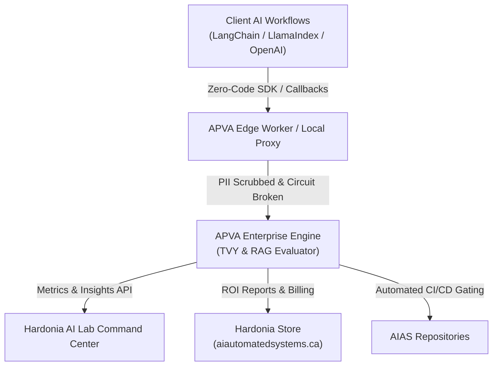

# APVA — AI Productivity & Value Architecture

> Measure the **true enterprise ROI of Generative AI** as a single time-denominated metric: **True Value Yield (TVY)**.

[](https://www.python.org/)
[](LICENSE)
[](https://github.com/Hardonian/apva-framework)
[](https://aiautomatedsystems.ca)
[](BOOTSTRAP.md)

---



---

## The Problem

Most AI benchmarks answer *"how fast did the model produce output?"* and ignore the only number a CFO cares about: **net human time saved**.

APVA answers: *"How much reliability-discounted, friction-adjusted human time did this AI workflow actually save — and what is it worth in USD?"*

$$\text{TVY} = (\text{Gross Time Saved} \times \text{RAG Reliability}) - \text{Guardrail Friction Tax}$$

---

## The Three Pillars

| Pillar | Captures | Key inputs |
| :--- | :--- | :--- |
| **Productivity** | Skill-stratified human baselines + epistemic verification | reference baseline, skill tier, AI generation time, verification time |
| **RAG Reliability** | Deterministic exact-span recall + SLM judge faithfulness | exact span recall, faithfulness score, retrieval coverage |
| **Value / Friction** | Operational friction, guardrail latency tax, and hourly rates | base latency tax, false-positive penalty, hourly practitioner wage |

These fuse into **TVY (True Value Yield)** — a defensible, time-denominated ROI metric you can compare across workflows, teams, and models.

---

## Hardonia & AIAS Ecosystem Integration

### 1. Leveraging in the AIAS Repository ([AI Automated Systems](https://aiautomatedsystems.ca))

#### A. Turnkey AI ROI & Valuation Audits

When auditing client AI systems, APVA provides the mathematical and auditable backbone to generate client scorecards:

* **Gross Time Saved**: Human baseline vs. AI generation and verification time.
* **RAG Reliability Discount**: Factored by exact span recall and SLM judge faithfulness.
* **Guardrail Latency Tax**: Quantified cost of slow semantic routers and false-positive blocks.
* **Diagnostic Directives**: Actionable prescriptions generated from `/api/v1/metrics/insights`.

#### B. Automated CI/CD Regression Gate

Integrate the `apva` CLI into GitHub Actions to fail PR builds if retrieval faithfulness degrades:

```yaml
# .github/workflows/aias-eval.yml
name: AIAS RAG Evaluation Gate
on: [push, pull_request]

jobs:
  tvy-eval:
    runs-on: ubuntu-latest
    steps:
      - uses: actions/checkout@v4
      - name: Set up Python
        uses: actions/setup-python@v5
        with:
          python-version: '3.12'
      - name: Install APVA
        run: pip install apva-framework
      - name: Run APVA Evaluation Gate
        run: |
          apva run-eval \
            --golden-set ./data/golden-dataset.json \
            --target-url ${{ secrets.AIAS_AGENT_URL }} \
            --threshold 0.85
```

#### C. Zero-Code Client Agent Telemetry

Equip AIAS client agents with native, non-blocking telemetry hooks:

```python
import os
from apva_langchain import APVACallbackHandler

handler = APVACallbackHandler(
    api_key=os.getenv("AIAS_APVA_KEY"),
    app_name="enterprise-rag-agent",
    human_baseline_time=25.0,  # Human equivalent in minutes
    hourly_rate_usd=85.00,     # Fully loaded hourly cost
)

# Pass handler into any LangChain runnable, agent, or chain
agent.invoke({"input": user_prompt}, config={"callbacks": [handler]})
```

---

### 2. Leveraging in the Hardonia Storefront ([Hardonian/storefront](https://github.com/Hardonian/storefront))

* **Enterprise TVY ROI Assessment SKU ($499 - $1,999)**: Fixed-scope engagement running APVA benchmarks across internal LLM/RAG pipelines to quantify ROI and eliminate token waste.
* **APVA Safeguard Shells & Edge Ingestion Add-on ($49/mo)**: Managed Cloudflare edge worker + ClickHouse aggregation ensuring sub-10ms telemetry ingestion and real-time PII stripping.
* **Interactive Storefront ROI Calculator**: Drop-in embeddable widget (`deploy/storefront-widget/apva-roi-calculator.js`) allowing prospective clients to calculate their annual TVY in USD before purchasing.
* **Stripe Metering Integration**: Connects [`StripeBillingService`](file:///c:/Users/scott/GitHub/apva-framework/apps/backend/apps/backend/services/billing.py) directly to Stripe usage-based metering for automated billing.

---

### 3. Hardonia Stack Architecture Matrix

| Layer | Repository | Role |
| :--- | :--- | :--- |
| **Routing & Local LLM** | [`ollama-router`](https://github.com/Hardonian/ollama-router) | High-throughput local model multiplexing & failover |
| **ROI & Metric Engine** | [`apva-framework`](https://github.com/Hardonian/apva-framework) | TVY benchmarking, RAG scoring & safeguard policies |
| **Security & Compliance** | [`ai-lab-audit-api`](https://github.com/Hardonian/ai-lab-audit-api) | Automated security, auth, and vulnerability auditing |
| **Operations UI** | [`ai-lab-command-center`](https://github.com/Hardonian/ai-lab-command-center) | Unified management and multi-tenant telemetry |
| **Commercial Hub** | [`storefront`](https://github.com/Hardonian/storefront) | Hardonia services, tools, and SaaS marketplace |

---

## Quick Bootstrap

```bash
# 0. Prereqs: Python 3.12+, uv or just
git clone https://github.com/Hardonian/apva-framework.git
cd apva-framework

# 1. One-command setup
just bootstrap
# or with uv directly:
uv sync --all-extras

# 2. Configure
cp .env.example .env

# 3. Run
just dev               # Start backend & dashboard
just test              # Run full pytest suite (44+ tests)
```

---

## Layout

```text
apva/            # Core TVY calculation engine & models
apps/
  backend/       # Enterprise FastAPI service (telemetry, eval, safeguards, metrics)
  dashboard/     # React + Vite analytics UI
  edge-worker/   # Cloudflare Worker global edge ingest
packages/
  sdk/           # Python SDK (client, async decorators, OpenAI proxy)
  apva-langchain/# Native zero-code LangChain callback handler
  apva-llamaindex# Native zero-code LlamaIndex callback handler
  cli/           # CLI tool for CI/CD eval & proxying
  sdk-ts/        # TypeScript SDK
deploy/          # Cloudflare Workers, D1 schema, and Storefront widget
tests/           # End-to-end test suite
```

---

## License

MIT — see [LICENSE](LICENSE).

---

## Related Hardonia Projects

[](https://aiautomatedsystems.ca)
[](https://github.com/Hardonian/ollama-router)
[](https://github.com/Hardonian/ai-lab-audit-api)
[](https://github.com/Hardonian/ai-lab-command-center)
[](https://github.com/Hardonian/storefront)

**Part of the [Hardonia](https://aiautomatedsystems.ca) open-source + services stack.**

> **Need to audit your team's AI ROI?** Run `apva run-eval` or book an [Enterprise TVY Audit on the Hardonia Store](https://aiautomatedsystems.ca/p/repo-rescue-saas-audit).
