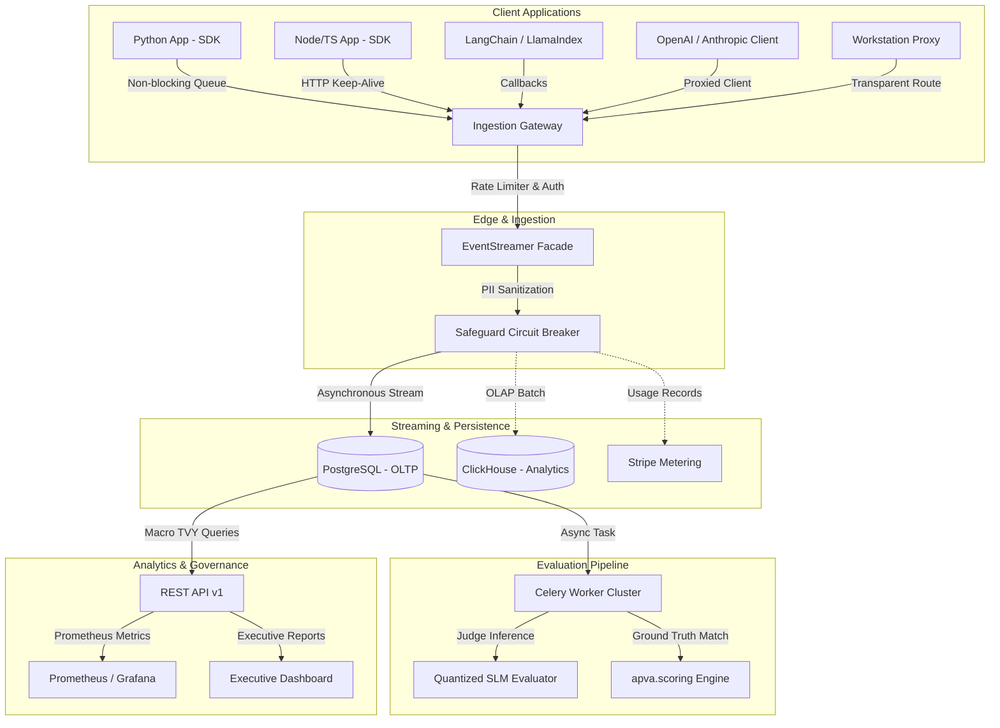

# APVA Framework: Architectural Specification & Mathematical Foundation

## 1. System Context & Overview

The **AI Productivity & Value Architecture (APVA)** is an enterprise framework engineered to quantify the **True Value Yield (TVY)** of Generative AI systems. While generic telemetry tracks tokens, latency, and costs, APVA maps these signals to **time-denominated human productivity equivalents** adjusted for retrieval unreliability and safety friction.

---

## 2. Mathematical Foundation of TVY

### Core Equation

$$\text{TVY} = (\text{GTS} \times \rho_{\text{RAG}}) - \tau_{\text{Guardrail}}$$

Where:

* **$\text{GTS}$** = Gross Time Saved (minutes)
* **$\rho_{\text{RAG}}$** = RAG Reliability Coefficient $\in [0, 1]$
* **$\tau_{\text{Guardrail}}$** = Guardrail Friction Tax (minutes)

### Pillar 1: Gross Time Saved ($\text{GTS}$)

$$\text{GTS} = (T_{\text{human\_baseline}} \times M_{\text{skill}}) - (T_{\text{AI\_generation}} + T_{\text{epistemic\_verification}})$$

* **$M_{\text{skill}}$**: Skill stratification multiplier:
  * Intern: $2.0\times$
  * Junior: $1.5\times$
  * Mid-level (Reference): $1.0\times$
  * Senior: $0.7\times$
  * Expert / Staff: $0.5\times$
* **$T_{\text{epistemic\_verification}}$**: Human cognitive load time required to audit, verify, and edit the AI deliverable for correctness.

### Pillar 2: RAG Reliability Coefficient ($\rho_{\text{RAG}}$)

$$\rho_{\text{RAG}} = (w_r \times \text{Exact\_Span\_Recall}) + (w_f \times \text{Faithfulness\_Score})$$

* Default convex weights: $w_r = 0.60$, $w_f = 0.40$ ($w_r + w_f = 1.0$).
* **Exact Span Recall**: Deterministic fraction of ground-truth evidence tokens recovered in retrieved context chunks.
* **Faithfulness Score**: Semantic grounding score computed by quantized SLM judges.

### Pillar 3: Guardrail Friction Tax ($\tau_{\text{Guardrail}}$)

$$\tau_{\text{Guardrail}} = T_{\text{base\_latency}} + (\text{FPR} \times T_{\text{resolution\_penalty}}) + T_{\text{CRA\_drop}}$$

* **$\text{FPR}$**: False Positive Rate of safety guardrails ($\in [0, 1]$).
* **$T_{\text{resolution\_penalty}}$**: Human minutes spent appealing or working around false rejections.
* **$T_{\text{CRA\_drop}}$**: Conversational Risk Accumulation penalty charged when an entire session context is discarded due to safety escalation.

---

## 3. Financial ROI Conversion

$$\text{TVY}_{\text{USD}} = \frac{\text{TVY}_{\text{min}}}{60} \times \text{Wage}_{\text{hourly}}$$

$$\text{Annual ROI}_{N} = \text{TVY}_{\text{USD}} \times \text{Tasks}_{\text{daily}} \times \text{Days}_{\text{annual}} \times N_{\text{practitioners}}$$

---

## 4. Qualitative Grading Matrix

| Grade | TVY Threshold (Minutes) | Strategic Interpretation |
| :--- | :---: | :--- |
| **EXCEPTIONAL** | $\ge 30.0$ min | Transformational productivity gain; high executive defensibility |
| **STRONG** | $15.0 - 29.9$ min | Defensible ROI; standard for mature enterprise copilots |
| **MODERATE** | $5.0 - 14.9$ min | Positive yield; requires prompt and retrieval tuning |
| **MARGINAL** | $0.0 - 4.9$ min | Break-even territory; vulnerable to minor latency spikes |
| **NEGATIVE** | $< 0.0$ min | Net operational loss; verification and friction exceed human baseline |
